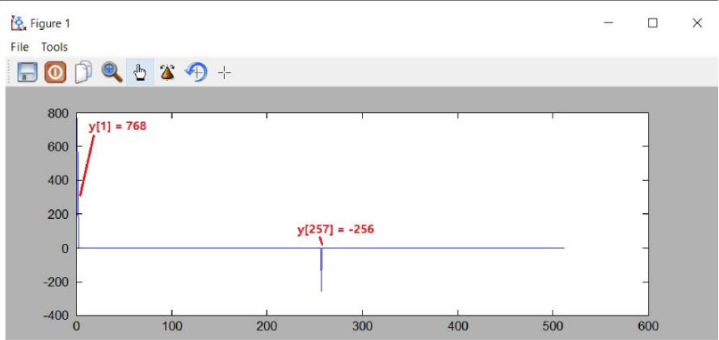

# NXP Application Code Hub
[](https://www.nxp.com)

## AN13496: Computing FFT with PowerQuad and CMSIS-DSP on LPC5500
This application note tells the usage of computing FFT with CMSIS-DSP software and PowerQuad hardware in the same computing case. PowerQuad hardware can replace CMSIS-DSP software when computing FFT for the same format of input and output. The demo cases show that PowerQuad runs much faster than CMSIS-DSP.

Please refer to AN13496 for complete instructions on how to use this software.
https://www.nxp.com/docs/en/application-note/AN13496.pdf

#### Boards: LPCXpresso55S69
#### Categories: Industrial
#### Peripherals: UART, GPIO, FLASH
#### Toolchains: IAR

## Table of Contents
1. [Software](#step1)
2. [Hardware](#step2)
3. [Setup](#step3)
4. [Results](#step4)
5. [FAQs](#step5) 
6. [Support](#step6)
7. [Release Notes](#step7)

## 1. Software<a name="step1"></a>

This application note uses a general computing process for all the demo computing cases. It runs the 512-point FFT transform from a given array to the expected output array.

### input

The input array includes pure real numbers {1, 2, 1, 2, 1, 2, ..., 1, 2} with the length of 512.

* For the real fixed-point numbers, they are the integer number 1 or 2.  
* For the real floating-point numbers, they are the floating number 1.0f or 2.0f. 
* For the complex fixed-point numbers, they are the complex number (1, 0) or (2, 0). 
* For the complex floating-point numbers, they are the complex number (1.0f, 0.0f) or (2.0f, 0.0f).

The values of input are same for different computing cases

### Output

The output array of values is all zero except for:

* The 0th number is 765.
* The 256th number is -256.

This output makes sense. As seen in the original input array, the average value of the input number is 1.5 and the amplitude of the simple switching waveform is 0.5. It means that the original input can be represented as 1.5-0.5, 1.5+0.5, 1.5-0.5, 1.5+0.5, .... The switching period is 2, with the frequency of ½. The phase is negative. No other frequency factors.

In the frequency field, the step for 512-point FFT is 1/512. Only the first item and the position for 1/2 (the 256th) are non-zero. The first item is for DC factor and the 256th is for the simple switching waveform. The value for the non-zero position is the amplitude: result [0] = 1.5, result [256] = -0.5.

When outputting the result, use the general mathematics calculator (like Matlab) to simplify the step of 1/N. It means that the direct output multiples N from the final result. In the cases in this document, the actual result is: result [0] = 768, result [256] = -256


software version information:

- SDK: 2.9.2
- FatFS: R0.14b
- CM33: IAR embedded Workbench 9.30.1

## 2. Hardware<a name="step2"></a>

- Micro USB Cable
- LPCXpresso55S69 LPC55S69-EVK Rev A1
- Personal Computer

The hardware use LPCXpresso55S69 EVK board, the hardware setting is same with SDK's hello world project.

## 3. Setup<a name="step3"></a>

Before running the  example, set up the hardware environment.

* Prepare an LPCXpresso55S69. 
* Connect a micro USB cable between the PC host and the Jlink USB port (P6) on the board
* Open a serial terminal with the following settings:
  - 115200 baud rate
  - 8 data bits
  - No parity
  - One stop bit
  - No flow control
* Download the program to the target board.
* Launch the debugger in your IDE to begin running the demo.

## 4. Results<a name="step4"></a>

To get the result, the calculation with FreeMat software (an open-source version of MabLab-like mathematics calculator, FreeMat) with the following script is also supported.

```
--> for (i = 1:512); x(i) = mod(i-1,2) + 1; end % create the input array in x.
--> y = fft(x) % run the fft and keep result in y
--> plot([1:1:512], y) % display the diagram of fft result 
```

The result is shown at the terminal.

```
y =
 1.0e+002 *
 Columns 1 to 6
 7.6800 + 0.0000i 0 0 0 0 0
 Columns 7 to 12
 0 0 0 0 0 0
 ...
 Columns 253 to 258
 0 0 0 0 -2.5600 + 0.0000i 0
 Columns 259 to 264
 0 0 0 0 0 0
 ...
 Columns 505 to 510
 0 0 0 0 0 0
 Columns 511 to 512
 0 0 
```




This application note tells the usage of computing FFT with CMSIS-DSP software and PowerQuad hardware in the same computing case. PowerQuad hardware can replace CMSIS-DSP software when computing FFT for the same format of input and output. The demo cases show that PowerQuad runs much faster than CMSIS-DSP. 

##  FAQs<a name="step5"></a>


## 6. Support<a name="step6"></a>
#### Project Metadata
<!----- Boards ----->
[](https://github.com/search?q=org%3Anxp-appcodehub+LPCXpresso55S69+in%3Areadme&type=Repositories)

<!----- Categories ----->
[](https://github.com/search?q=org%3Anxp-appcodehub+industrial+in%3Areadme&type=Repositories)

<!----- Peripherals ----->
[](https://github.com/search?q=org%3Anxp-appcodehub+uart+in%3Areadme&type=Repositories) [](https://github.com/search?q=org%3Anxp-appcodehub+gpio+in%3Areadme&type=Repositories) [](https://github.com/search?q=org%3Anxp-appcodehub+flash+in%3Areadme&type=Repositories)

<!----- Toolchains ----->
[](https://github.com/search?q=org%3Anxp-appcodehub+iar+in%3Areadme&type=Repositories)

Questions regarding the content/correctness of this example can be entered as Issues within this GitHub repository.

>**Warning**: For more general technical questions regarding NXP Microcontrollers and the difference in expected funcionality, enter your questions on the [NXP Community Forum](https://community.nxp.com/)

[](https://www.youtube.com/@NXP_Semiconductors)
[](https://www.linkedin.com/company/nxp-semiconductors)
[](https://www.facebook.com/nxpsemi/)
[](https://twitter.com/NXP)

## 7. Release Notes<a name="step7"></a>
| Version | Description / Update                           | Date                        |
|:-------:|------------------------------------------------|----------------------------:|
| 1.0     | Initial release on Application Code HUb        | June 7<sup>th</sup> 2023 |

